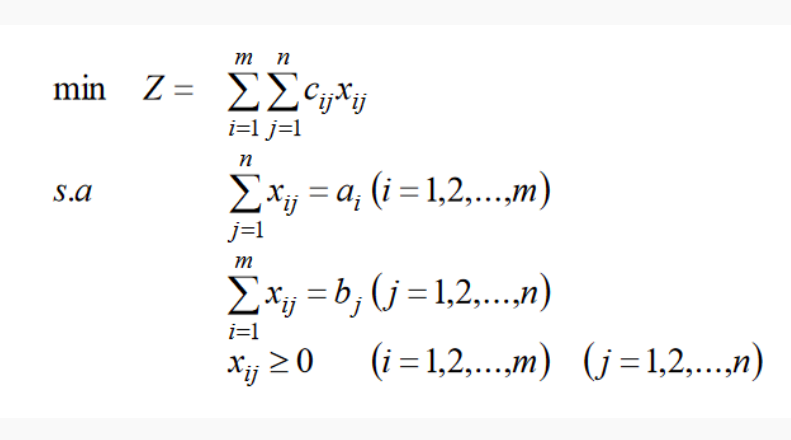

# Otimização de Transporte
Aplicação python com uso do método simplex, para otimização de entregas de uma rede para seus clientes.

## Objetivo
Aplicação desenvolvida a fim de aplicar uma modelagem para minimização do custo de entregas, de uma rede de lojas para seus clientes e filiais. Considerando como custo a distância entre as origens e destinos e determinando quais lojas entregaram a quantidade de produtos, levando em consideração o estoque de cada loja e a quantidade requisitada de cada destino.

## Modelagem e Aplicação
A modelagem é a mesma para otimização de transporte para uso no método simplex:

Este algoritmo, necessita de dois banco de dados, que são os arquivos "farmacias.csv" e "solicitacoes.csv", ambos contem um indice, latitude, longitude e estoque ou demanda. Como no exemplo:

- "farmacias.csv"

| Loja | Latitude | Longitude | Estoque |
|------|----------|-----------|---------|
|1    | -16.713938 | -43.853936 | 50 |   
|2    | -16.740162 | -43.861820 | 50  | 
|3    | -16.740076 | -43.870815 | 50  |

- "solicitacoes.csv"

| Cliente | Latitude | Longitude | Solicitação |
|------|----------|-----------|---------|
|1    | -16.698133 | -43.869378 | 5     |
|2    | -16.707669 | -43.865173 | 45     |
|3    | -16.694737 | -43.843540 | 100  |

Ao lêr os arquivos, armazena as coordenadas e calcula a distância entre todas as lojas para cada solicitação utilizando a Fórmula de Haversine, que é uma importante equação usada em navegação, fornecendo distâncias entre dois pontos no globo a partir de suas latitudes e longitudes, estas serão o custo de transporte de cada loja para os clientes.

- Tabela do Problema Inicial

| Lojas | S1 | S2 | S3 | Estoque |
|------|----------|-----------|---------|---------|
|L1          | 2  | 1  | 2   | 50     | 
|L2          | 5  | 4  | 5   | 50      |
|L3          | 5  | 4  | 6   | 50      |
|Solicitação | 5  | 45 | 100 |    ---    |

A partir dessas funções, organizamo-as para que pudessem ser passadas para o algoritmo Simplex Solver, desenvolvido por Michael Stott, em seu repositório no Github citado abaixo, realizamos a alteração desse algoritmo para que atendesse as nossas necessidades.

Por final o algoritmo retorna na tela a solução e gera um arquivo .tex que pode ser compilado com o compilador latex de preferência, e assim obter o relatório em PDF.  

## Execução

## Desenvolvedores

- [Mirrális Dias Santana](https://github.com/MirrasHue) - Graduando em Ciência da Computação - IFNMG - Montes Claros/MG

- [Reinaldo Junio Dias de Abreu](https://github.com/ReinaldoDiasAbreu) - Graduando em Ciência da Computação - IFNMG - Montes Claros/MG

Aplicação desenvolvida como trabalho de conclusão para disciplina de Pesquisa Operacional, ministrada pela professora [Luciana Balieiro Cosme](https://github.com/lucianaa/).

## Créditos

 - Implementação em Python do Método Simplex: Disponível em: [SimplexSolver](https://github.com/MichaelStott/SimplexSolver)
 - Referêncial Teórico: Disponível em: [A programação linear para otimização em problemas de transporte](https://repositorio.ufpb.br/jspui/handle/123456789/2484)
