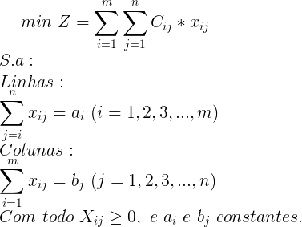

# Otimização de Transporte
Aplicação em python com uso do método simplex para otimizar entregas de uma rede de farmácias.

## Objetivo
Desenvolver um programa com o fim de aplicar uma modelagem para minimização do custo de entregas entre farmácias e clientes. Foi considerado como custo a distância entre as lojas e os destinos, para assim determinar quais estabelecimentos devem fazer a entrega a um certo cliente de modo a minimizar o custo, levando em consideração o estoque de cada loja e a quantidade requisitada em cada pedido.

## Modelagem e Aplicação
Esta é a modelagem que minimiza o custo de transporte, e que será usada no método simplex:



Este algoritmo, necessita de dois aquivos .csv, que são "farmacias.csv" e "solicitacoes.csv", ambos contém um índice, latitude, longitude e estoque ou demanda, separados por vírgula. Como no exemplo:

- "farmacias.csv"

| Loja | Latitude | Longitude | Estoque |
|------|----------|-----------|---------|
|1|-16.751524|-43.879035|50|
|2|-16.713941|-43.853944|50|
|3|-16.740076|-43.870815|50|


- "solicitacoes.csv"

| Cliente | Latitude | Longitude | Solicitação |
|------|----------|-----------|---------|
|1|-16.690414|-43.836981|5|
|2|-16.713023|-43.837304|45|
|3|-16.730625|-43.857152|100|


Após os arquivos serem lidos, as coordenadas são armazenadas e é calculada a distância de todas as lojas para cada solicitação utilizando a Fórmula de Haversine, que é uma importante equação usada em navegação, fornecendo distâncias entre dois pontos no globo a partir de suas latitudes e longitudes, estas serão o custo de transporte de cada loja para cada cliente.

- Tabela do Problema Inicial

| Lojas | S1 | S2 | S3 | Estoque |
|------|----------|-----------|---------|---------|
|L1          | 8  | 6  | 3   | 50     | 
|L2          | 3  | 2  | 2   | 50      |
|L3          | 7  | 5  | 2   | 50      |
|Solicitação | 5  | 45 | 100 |    ---    |

Com esses dados obtemos a função objetivo e restrições:

Z = 8x1 + 6x2+ 3x3 + 3x4 + 3x5 + 3x6 + 7x7 + 5x8 + 2x9

Sujeito a:

x1 + x2 + x3 <= 50

x4 + x5 + x6 <= 50

x7 + x8 + x9 <= 50

x1 + x4 + x7 = 5

x2 + x6 + x8 = 45

x3 + x7 + x9 = 100

x1, x2, x3, x4, x5, x6, x7, x8, x9 >= 0

Estas restrições são organizadas para servirem como entrada para o sistema de solução online para otimização de transporte, desenvolvido na CEFET-MG, sisponível no seguinte endereço: [SIMO](https://otimizacao.js.org/transporte.html).

Por final, o algoritmo gera um arquivo txt da modelagem que pode ser transferido para o SIMO que gera a solução de forma clara, por meio de tabelas, indicando as lojas de saída, quantidade e clientes de destino.  

- Solução para o exemplo acima

| Loja | Quant. | Cliente |
|------|--------|---------|
|1    |50     | 3      |
|2    | 5    | 1    |
|2    | 45    | 2       |
|3    | 50    | 3       |
| |
|Custo Total:|10.0 Km|
|Número de Farmácias:|3|
|Número de Clientes:|3|

Caso o problema seja desbalanceado, o algoritmo fará o tratamento automático adicionando as variáveis fantasmas para balanceá-lo e alertará o usuário.

## Execução

Para executar esse algoritmo, é necessesário ter instalado o python (v. 3.7.5) ou superior, o numpy (v. 1.17.4).

Para rodar pelo terminal, utilize o seguinte comando no diretório do algoritmo:

```

python3 otimiza.py <csv_fornecimento> <csv_destinos>

```

Especificando os dois arquivos csv correspondentes as lojas e aos clientes, conforme exemplificado anteriormente.

## Desenvolvedores

- [Mirrális Dias Santana](https://github.com/MirrasHue) - Graduando em Ciência da Computação - IFNMG - Montes Claros/MG

- [Reinaldo Junio Dias de Abreu](https://github.com/ReinaldoDiasAbreu) - Graduando em Ciência da Computação - IFNMG - Montes Claros/MG

Aplicação desenvolvida como trabalho de conclusão para disciplina de Pesquisa Operacional, ministrada pela professora [Luciana Balieiro Cosme](https://github.com/lucianaa/).
